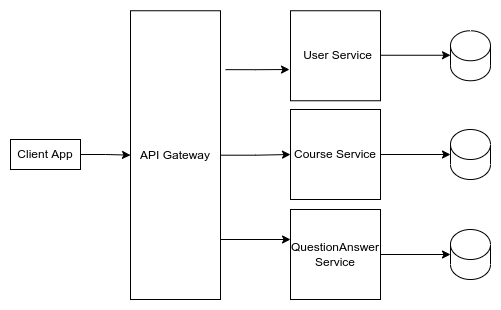
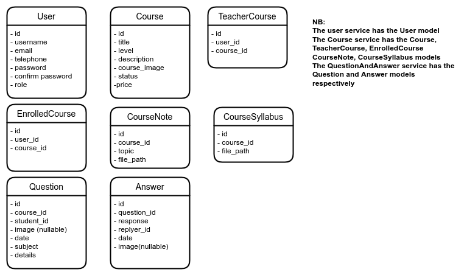

# Learning Management System API
 REST Microservice Architecture for a Learning Management System with SpringBoot, Cloud and three Microservices. This porject is objective at learning how to create microservices with spring boot. We seek to create a simple learning system with three users namely; Admin, Teachers, and Students.
 The Admin manages courses, teachers and students.
 Teachers can create a course, provide the course content(syllabus) and notes as pdf documents and also provide answers to questions that will be ask by students enrolled to the course. 
 Students can enroll to any course, download the course syllabus and notes, and ask or answer any questions related to the course notes.
## Microservices
* User
* Course
* QuestionsAndAnswers
## Tools and Technologies
* Springboot 2.5
* Java 11
* Hibernate Validator
* Swagger API Annotation
* Swagger UI
* MySQL 5
* Maven 4.0
* JUnit
* Mockito
* Spring Security
* Oauth2
* Spring Cloud OpenFeign
* Spring Data JPA
* Docker
* Netflix Eureka Server
* NetFlix Eureka Client
## Users
* Admin
* Teacher
* Student
## Features
### Administrator
* User(Student and Teacher) Management
* Course  Management
### Teacher
* Course Creation and Updates
* Uploading Course syllabus and notes
* Provide Answers to Course question
### Student
* Enroll to a Course
* View and download all Course syllabus and notes
* Ask/Answer Questions related Course Notes
### Coding Conventions 
* All class names must follow the Java naming style(Capitalized)
* All variables must follow the camel-case style
* All public endpoints should follow this convention: {server-name}/api/public/v1/{end-point-name}
* All public endpoints should follow this convention: {server-name}/api/protected/v1/{end-point-name}
### Endpoints to be created
* Register User( Teacher and Student) [public]
* Login User ( Admin, Teacher, Student) [public]
* Show user profile [protected]
* Update user profile [protected]
* Delete user( Teacher or Student) [protected]
* Create Course  [protected]
* Get all courses [public]
* Get all courses belonging to a Teacher [protected]
* Get information about a single course [protected]
* Update course [protected]
* Delete course [protected]
* Upload course syllabus as pdf documents [protected]
* Upload course notes [protected]
* Ask questions about course [protected]
* Provide response to course questions [protected]
* Get all questions of courses [protected]
* Get all responses to all questions of a course [protected]
* Enroll student to course [protected]
* Download course syllabus[protected]
* Download course notes [protected]
* Get all students of the system [protected]
* Get all teachers of the system [protected]
* Get all students enrolled in a course [protected]
### Project Architecture

### Project Database Design

