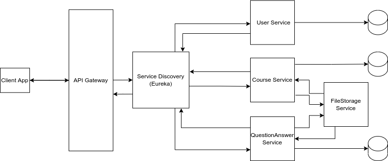

# Learning Management System API
REST Microservice Architecture for a Learning Management System with SpringBoot, Cloud and three Microservices. This project is aim at learning how to create      Microservices using Spring boot,and Spring cloud, explore and appreciate the different Technologies and Tools that are use to develop systems that run using Microservice Architecture. 
Hence, I seek to create a simple learning system with three users namely; Admin, Teachers, and Students.
The Admin manages courses, teachers and students.
Teachers can create a course, provide the course content(syllabus) and course notes as pdf documents, provide answers to questions that will be ask by students enrolled to the course. 
Students can enroll to any course, download the course syllabus and notes, and ask or answer any questions related to the course notes.
## Microservices
* User
* Course
* QuestionsAndAnswers
* FileStorage Service
## Tools and Technologies
* Springboot 2.5
* Java 11
* Hibernate Validator
* Swagger API Annotation
* Swagger UI
* MySQL 5
* Maven 4.0
* JUnit
* Mockito
* Spring Security
* Oauth2
* Spring Cloud OpenFeign
* Spring Data JPA
* Docker
* Netflix Eureka Server
* NetFlix Eureka Client
## Users
* Admin
* Teacher
* Student
## Features
### Administrator
* User(Student and Teacher) Management
* Course  Management
### Teacher
* Course Creation and Updates
* Uploading Course syllabus and notes
* Provide Answers to Course question
### Student
* Enroll to a Course
* View and download all Course syllabus and notes
* Ask/Answer Questions related Course Notes
### Coding Conventions 
* All class names must follow the Java naming style(Capitalized)
* All variables must follow the camel-case style
* All public endpoints should follow this convention: {server-name}/api/public/v1/{end-point-name}
* All public endpoints should follow this convention: {server-name}/api/protected/v1/{end-point-name}
### Some of the Endpoints to be created
* Register User( Teacher and Student) [public]
* Login User ( Admin, Teacher, Student) [public]
* Show user profile [protected]
* Update user profile [protected]
* Delete user( Teacher or Student) [protected]
* Create Course  [protected]
* Get all courses [public]
* Get all courses belonging to a Teacher [protected]
* Get information about a single course [protected]
* Update course [protected]
* Delete course [protected]
* Upload course syllabus as pdf documents [protected]
* Upload course notes [protected]
* Ask questions about course [protected]
* Provide response to course questions [protected]
* Get all questions of courses [protected]
* Get all responses to all questions of a course [protected]
* Enroll student to course [protected]
* Download course syllabus[protected]
* Download course notes [protected]
* Get all students of the system [protected]
* Get all teachers of the system [protected]
* Get all students enrolled in a course [protected]
* Approve Teachers
### Project Architecture

### Project Database Design

### How to run Project.
#### Work done so far:
The CourseService, UserService, QuestionAndAnswerService and FileStorageService have been implemented. So users(Student, Teacher) can now be created, courses can be created and syllabus/notes provided for it, questions can be asked and answer provided, and finally, files under all categories(IMAGES,NOTES,SYLLABUSES,QUESTIONS,ANSWERS) can be uploaded and downloaded.
#### TO DO
* Authentication and Authorization. 
  Note: All endpoints with the signature [ /api/v1/protected/ ] requires authentication/authorization, while those with  [/api/v1/public/] don't need       authentication/authorization.
* API-GATEWAY has been setup been needs to be completed and configured, so all requests do pass through the gateway to the respective service.
* Add a docker-compose script to run all services
* Finally the project is open for improvements and other new features.
*
### To Run the Project:
* Clone the project from the link or download the zip file.
* Open/Unzipped all the projects and open each service(User,Course, QuestionAndAnswer, File services) in your IDE(intelliJ/eclipse)
* Start your MySQL database server. 
  Remark: This project makes use of MySQL database server, so if you want to use another server, you can update the application.properties file of each     of the microservices. 
* Run the services in the order
* Run the Eureka-Naming Service and open [http://loclhost:8761] in the browser to view it
* Run the FileStorageService and open [http://localhost:7000/swagger-ui/#/]  to view the api documentation.
* Run the UserService and open [http://localhost:8000/swagger-ui/#/] to view the api documentation.
* Run the CourseService and open [http://localhost:8001/swagger-ui/#/] to view the api documentation.
* Run the QuestionAndAnswerService and open [http://localhost:8002/swagger-ui/#/] to view the api documentation.
* You start by creating a some users with Teacher and Student roles, creating courses, uploading the notes/syllabus,assigning students to course, view the course notes/syllabuses and asking questions.
  

